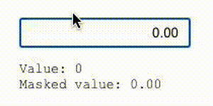

# react-input-decimal

A simple React input component to work with decimal values.

## How to use

Install with `npm install react-input-decimal` or `yarn add react-input-decimal`

```ts
import { useState } from 'react'
import { InputDecimal } from 'react-input-decimal'

export default function App() {
  const [value, setValue] = useState(0)
  const [maskedValue, setMaskedValue] = useState('0.00')

  return <>
    <InputDecimal
      value={value}
      onChangeValue={(value, maskedValue) => {
        setValue(value)
        setMaskedValue(maskedValue)
      }}
    />
    <pre>
      Value: {value}<br />
      Masked value: {maskedValue}
    </pre>
  </>
}
```



## Available props

| Prop        | Type | Description |
|-------------|------|-------------|
| `precision`   | number | (optional) default is 2 |
| `decimalSeparator` | `',' \| '.'` | (optional) default is `'.'` |
| `useThousandSeparator` | `boolean` | (optional) default is `true` |
| `align`   | `'right' \| 'left'` | (optional) default is `'right'` |
